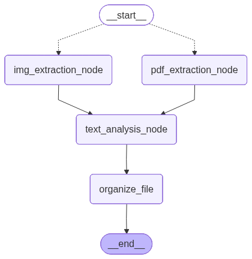

# What it is
A tiny PoC pipeline that extracts text from PDFs and images asks an LLM to classify & summarize the files, then renames/moves these into organized folders.

# How to run 
Install uv
```  
https://docs.astral.sh/uv/getting-started/installation/
```

sync dependencies
```bash
uv init
uv sync
```

setup .env file
```
OPENAI_API_KEY=<YOUR_API_KEY>
```

check config.yaml and configure to your needs. details see below
```
llm_model: "gpt-5-nano"
llm_temperature: 0

input_folder: ./_INBOX
...
```
run the app
```
python main.py
```


# Configuration
- Edit `config/config.yaml` to tune model, folders, categories and naming templates. Key options you’ll likely use:
	- `llm_model` — model id for the LLM
	- `input_folder` — where to drop PDFs
	- `output_folder` — basesfolder where processed files are moved to
	- `report_folder` - where the logs are stored
    - `category_list` — classification categories
    - `category_paths` - target paths for each category

# Overall flow (the short version)
- Entrypoint: `main.py` builds the pipeline and processes PDFs from the configured input folder.
- Steps:
	1. Text extraction (`src/pdf_text_extractor.py` or `src/img_text_extractor.py`)
	2. LLM analysis: classification, entities, summary (`src/file_analyzer.py`)
	3. Organize & move file (`src/file_organizer.py`)
- Logging & reports are handled by `src/logger.py`.



That’s it — drop PDFs in, watch the bot sort your paperwork, and take credit for being extremely organized.

# Roadmap
- implement label extraction and folder overwrites based on labels
- ~~add support for image text extraction~~